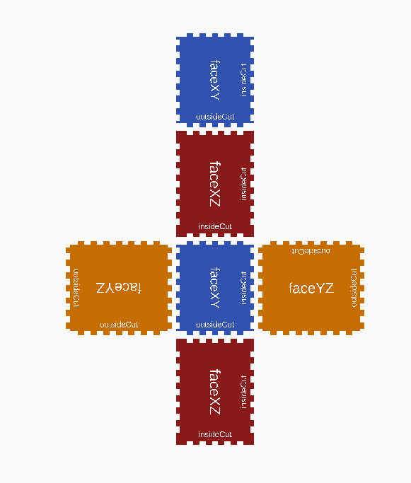

# Finger Joint Box

OpenSCAD library for creating customizable laser cut boxes that use comb joints to connect the edges. This method of joining faces is secure, stable and once assembled, quite strong.


[Live Demo Version on Thingiverse](https://www.thingiverse.com/thing:2590922)

## Description

This is an [OpenSCAD](https://openscad.org/about.html) _library_ intended to be used in other projects to create DXF/SVG files that are compatible with most laser cutters. The library calculates the appropriate number of joints for joining laser cut parts given an edge length, material thickness and joint width.


For a complete project with documented code using this library see [The ItsyBitsy Useless Machine](https://github.com/txoof/Useless_Machine/blob/main/README.md). The project includes OpenSCAD files that demonstrate the use of many of the features of this library.

## Background

To use, `fingerjoint.scad` should be placed within the project directory (or any other accessible path) and imported with `use <path/to/fingerjoint.scad>`.

When faces are joined in a box, it is necessary to have a staggered comb teeth with a complimentary pattern so there is an alternating and opposite pattern of negative and positive spaces. See faceXY and faceYZ where they meet in the image below.



FaceYZ uses the function `insideCuts()` where it meets faceXY. FaceYZ uses the function `outsideCuts()` to provide the opposite pattern.

## Usage

Generate a ready-to-cut svg with dimensions 100x120x135mm with fingers 8mm wide for material 5mm thick. 

To produce a cuttable SVG use _File > Export > Export as SVG_. 

```OpenSCAD
/* [Box Dimensions]*/
//X Dimension
xDim = 100;
//Y Dimension
yDim = 120;
//Z Dimension
zDim = 135;
//material thickness
material = 5;
//finger width
finger = 8;
//add debugging text
text=true

2Dlayout(xDim = xDim, 
         yDim = yDim, 
        zDim = zDim, 
        finger = finger, 
        material = material,
        text = helpText);
```

Generate a 3d rendering with the same dimensions.

It is theoretically possible to generate an STL from this, but that would be a very bad idea because none of the clearances are calculated for extrusion methods.

```OpenSCAD
/* [Box Dimensions]*/
//X Dimension
xDim = 100;
//Y Dimension
yDim = 120;
//Z Dimension
zDim = 135;
//material thickness
material = 5;
//finger width
finger = 8;
//add debugging text
text=true

3Dlayout(xDim = xDim, 
         yDim = yDim, 
         zDim = zDim, 
         finger = finger, 
         material = material,
         text = helpText);
```

Generate a centered XY face with 100x120 mm dimensions.

```OpenSCAD
//X Dimension
xDim = 100;
//Y Dimension
yDim = 120;
faceXY(xDim = xDim, 
       yDim = yDim, 
       finger = finger, 
       material = material, 
       center = true, 
       text = text);
```

## Functions

**Note:** in all cases, the finger width must be < 1/3 the total edge length to prevent overlap. There is minimal error checking for this.

### 2DLayout

Generate a ready-to-cut 2D layout.

```OpenSCAD
2DLayout()

  Parameters:
  - xDim(real): X dimension of box
  - yDim(real): Y dimension of box
  - zDim(real): Z dimension of box
  - finger(real): width of finger joints
  - material(real): thickness of material to be used
  - text(boolean): include debugging text for reference
```

### 3DLayout

Generate a 3D visualization of the box

```OpenSCAD
3DLayout() 

  Parameters:
  - xDim(real): X dimension of box
  - yDim(real): Y dimension of box
  - zDim(real): Z dimension of box
  - finger(real): width of finger joints
  - material(real): thickness of material to be used
  - text(boolean): include debugging text for reference
```

### faceXY, faceXZ, faceYZ

Generate faces of given dimensions with appropriate, complimentary joints. All faces follow the same convention as the one shown below, but with relevant dimensions.

```OpenSCAD
faceYZ()

  Parameters:
  - yDim(real): y dimension in mm
  - zDim(real): z dimension in mm
  - finger(real): width of finger in mm
  - material(real): thickness of material to be cut in mm
  - center(boolean): center on the axis (default: false)
  - text(boolean): add debugging text to the face (default: true)
```

### insideCuts

Generate a positive 2D shape that can be used for cutting fingers in an edge using `difference`. All of the cuts for this function fall entirely inside the length of the edge. See the edges labeled "insideCut" on faceXZ in the example above.

```OpenSCAD
insideCuts()

  Parameters:
  - length(real): total length of edge to be cut in mm
  - finger(real): width of each finger in mm
  - material(real): thickness of material in mm
  - text(boolean): include debugging text (default: true)
  - center(boolean): center on the axis
```

### outsideCuts

Generate a positive 2D shape that can be used for cutting fingers in an edge using `difference`. The first and last cuts fall over the edge of the edge. See the edges labeled outsideCut on faceYZ in the example above.

```OpenSCAD
outsideCuts()

  Parameters:
  - length(real): total length of edge to be cut in mm
  - finger(real): width of each finger in mm
  - material(real): thickness of material in mm
  - text(boolean): include debugging text (default: true)
  - center(boolean): center on the axis
```